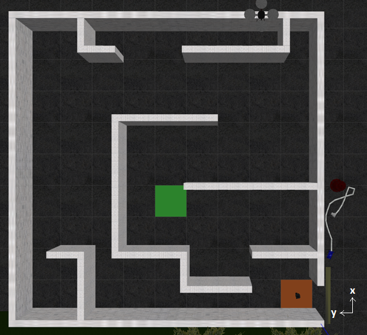
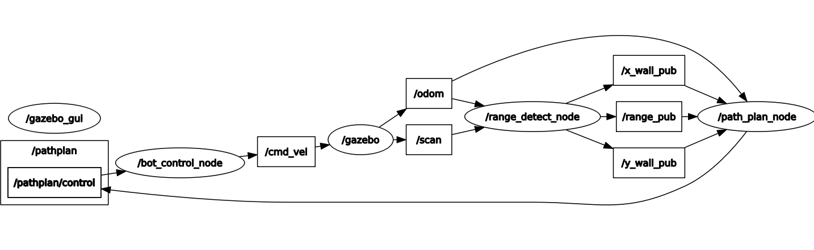
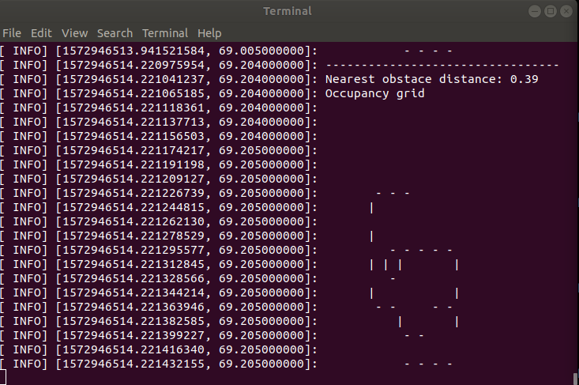
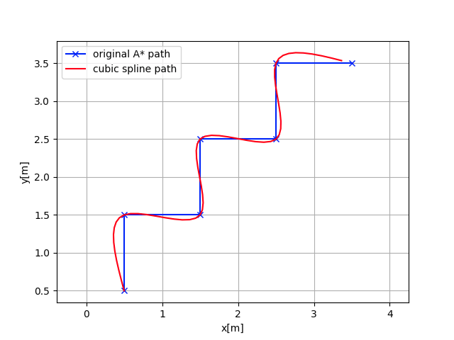
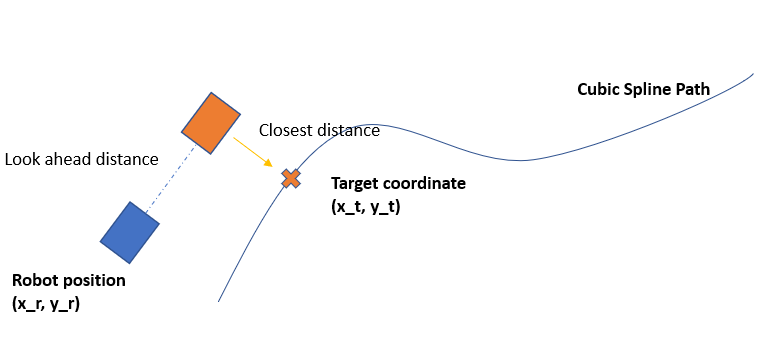
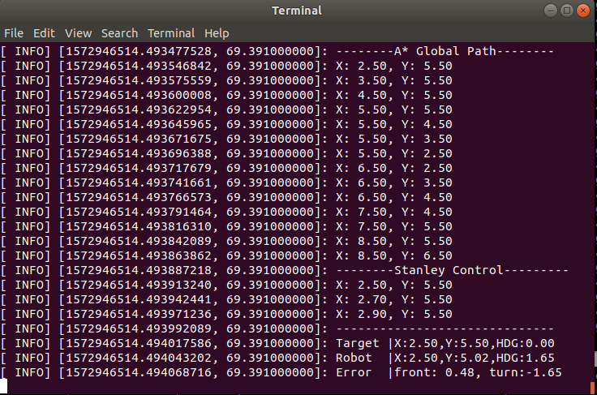
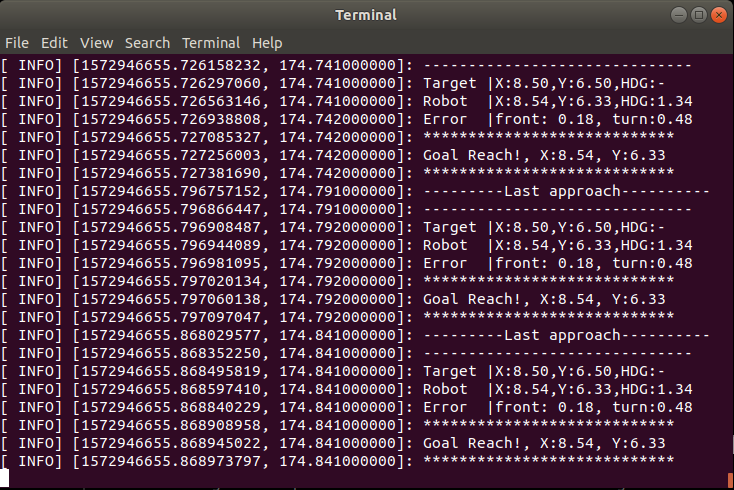

# **Path Planning for a structured maze in Gazebo ROS with Turtlebot**
Continuous Assessment 2 of ME3243 Robotic System Design (NUS)



*Fig 0: The structured maze environment*


## Objective
To enable a telebot to navigate in an unknown yet structured environment with limited access to its information. The telebot is equipped with perfect sensors - odometry module and laser scan module. The environment is set up as a grid of size 9x9 of a resolution of 1(m). 



*Fig 1: RQT Graph of all active ROS Nodes*

No| ROS Topic          |  Description                           | 
--|-----------------|---                                        |
 1|  x_wall_pub     | Location of x wall                        | 
 2|  y_wall_pub     | Location of y wall                        | 
 3|  range_pub      | Distance and angle to the closest obstacle| 
 4|  path_plan/control    | Forward and heading error           |  
 5|  cmd_vel        | Control command to move turtlebot         |  
 6|  scan           | Laser scanning data                       | 
 7|  odom           | Odometry data of telebot                  |    


### Occupancy Grid


*Fig 2: Resulting occupancy grid after some data manipulations*

### Path Planning



*Fig 3: Illustration of cubic spline path generated from discrete A\* nodes*

* A* global path planning  
* Cubic Spline local path planning

### Path Tracking

 

*Fig 4: Stanley Control's search of next target position*


### Result



*Fig 5: Resulting A\* and Cubic Spline path (Only first three nodes are shown)*



*Fig 6: Indication of telebot reaching the goal position*

## Dependencies
#### Tested on ROS Melodic

- turtlebot3
- ROS Gazebo


## Basic Build Instructions

1. Clone this repo
2. Edit gazebo_nav_stack/bin/melodic_project_init_world_1.sh


Locate the path of turtlebot3_simulation package in your system and replace the directory.
```
sudo cp ../worlds/test_world_1.world ${turtlebot3_simulation path}/turtlebot3_gazebo/worlds/
sudo cp ../worlds/turtlebot3_maze.launch ${turtlebot3_simulation path}/turtlebot3_gazebo/launch/
```

3. Launch the gazebo environment 
```
cd catkin_ws
catkin_make
cd src/gazebo_nav_stack/bin
./melodic_project_init_world_1.sh
```
4. Change the Goal position at gazebo_nav_stack/include/PreDefine.cpp 

Look for and change the number to the *grid INDEX* that you intend to reach.

```
#define GOAL_X 4 //target position
#define GOAL_Y 0 //target position
```

The index for both X and Y range is [0,9].

5. Launch all nodes 

```
cd ./catkin_ws
catkin_make
roslaunch gazebo_nav_stack start_all_nodes.launch
```

